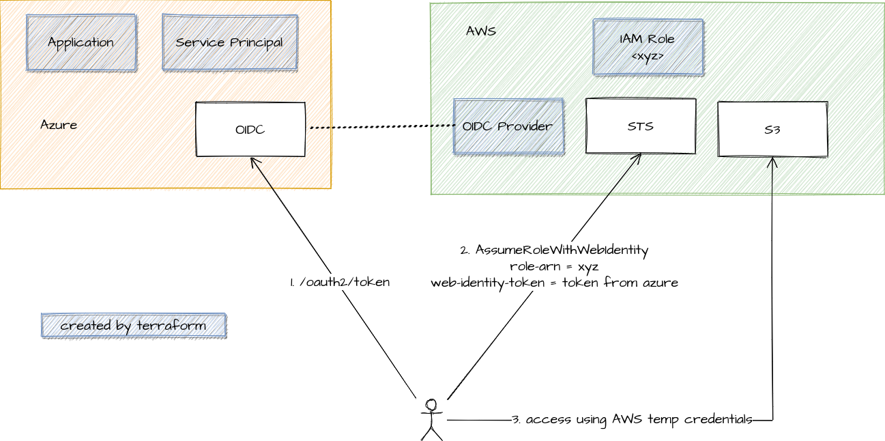

# azure-aws-identity

an example setup to demonstrate assuming an AWS IAM role using Azure credentials

## Prerequisite

- Azure and AWS accounts/CLIs setup
- terraform, jq, taskfile

## Run

- Login to Azure using Azure CLI `az login --allow-no-subscriptions`
- Login to AWS CLI
- Run `task infra:apply`: this creates necessary infrastructure in Azure and AWS and writes terraform output to `./tmp/.env` (to be used by subsequent tasks)
- Run `task assume-aws-role`. This will:
    - login to Azure service principal, get Azure access token
    - call AWS STS to assume role with web identity (Azure access token)
    - write AWS temporary credentials to `./tmp/aws/secrets.json`
- Run `task access-aws-resources`: this tests the AWS temporary credentials by:
    - get caller identity from STS
    - list s3 buckets
    - list dynamodb tables. This operation will fail because the assumed IAM role only has permission to S3

## Reference

- https://aws.amazon.com/blogs/security/how-to-access-aws-resources-from-microsoft-entra-id-tenants-using-aws-security-token-service/
- https://www.linkedin.com/pulse/assume-role-via-webidentity-from-azure-jun-hua-li
